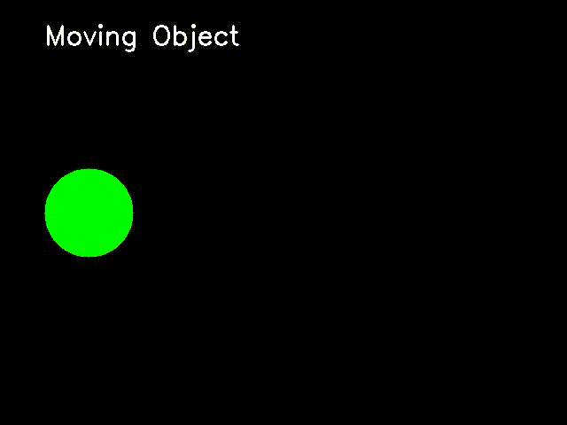

# ROS2 YOLO Object Detection Pipeline

## 🎥 Демонстрация работы

[

*Нажмите на скриншот, чтобы открыть видео. На видео: запуск пайплайна, работа фейкового детектора и визуализация.*

## 🚀 Быстрый запуск

# Сборка
cd ~/ros2_ws
colcon build --packages-select my_msgs my_cv_pkg
source install/setup.bash

# Запуск всех узлов одной командой
ros2 launch my_cv_pkg demo.launch.py

🏗️ Архитектура

camera_publisher → /camera/image_raw → fake_detector → /detected_objects → visualizer
                                          ↓
                                    (публикует фейковый
                                     bounding box в центре)
🎯 Что вы увидите при запуске
Зелёная рамка в центре кадра (имитация детекции)

Текст "Fake Object (0.95)" над рамкой

Красная точка в центре объекта

Примечание: на видео используется фейковый детектор для демонстрации пайплайна. Интеграция реального YOLO — в планах.

📁 Структура проекта

ros2_yolo_cpp/
├── my_msgs/                    # Кастомные сообщения
│   └── msg/
│       ├── BoundingBox.msg
│       └── DetectionArray.msg
└── my_cv_pkg/                  # Основной пакет
    ├── launch/
    │   └── demo.launch.py
    └── src/
        ├── camera_publisher.cpp
        ├── fake_detector.cpp
        └── visualizer.cpp
🚧 Планы
Интеграция YOLO с LibTorch

Добавление ноды controller_node

Поддержка видеофайлов

👤 Автор
Ekaterina Lavlinskaya

📝 Лицензия: Apache 2.0
